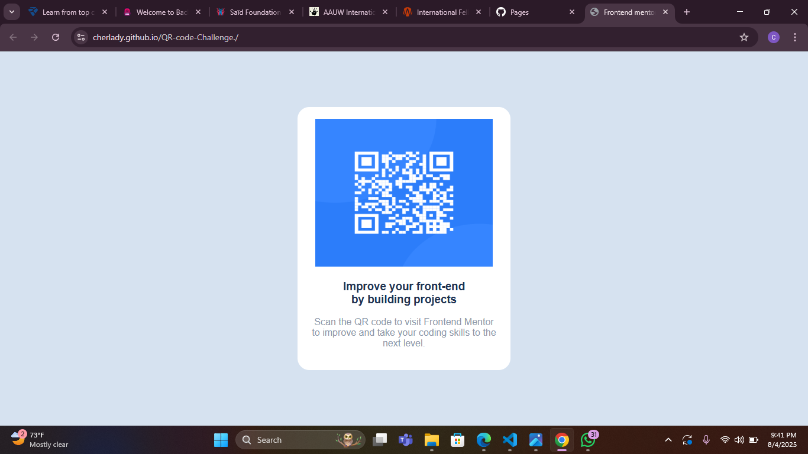

# Frontend Mentor - QR code component solution

## Table of contents

- [Overview](#overview)
  - [Screenshot](#screenshot)
  - [Links](#links)
- [My process](#my-process)
  - [Built with](#built-with)
  - [What I learned](#what-i-learned)
  - [Continued development](#continued-development)
  - [Useful resources](#useful-resources)
- [Author](#author)
- [Acknowledgments](#acknowledgments)

**Note: Delete this note and update the table of contents based on what sections you keep.**

## Overview

### Screenshot

### Links

- Solution URL: [Add solution URL here](https://github.com/Cherlady/QR-code-Challenge..git)
- Live Site URL: [Add live site URL here](https://cherlady.github.io/QR-code-Challenge./)

## My process

### Built with

- Semantic HTML5 markup
- CSS custom properties
- CSS flex box and grid 
 

### What I learned

my major lesson was learning how to insert the qr coide and text in one big template,centering the template and ensuring a responsive page.

### Continued development

I want to focus on building my css skills, mastering flexbox and grid techniques to be able to write clean and maintainable css 

## Author

- Website - [cherish]()
- Frontend Mentor - [cherlady](https://www.frontendmentor.io/profile/chrladye)
- Twitter - [cherlady_](https://www.twitter.com/cherlady)

## Acknowledgments

To my dearest MOH, Thank you for taking time out of your busy schedule to help.

